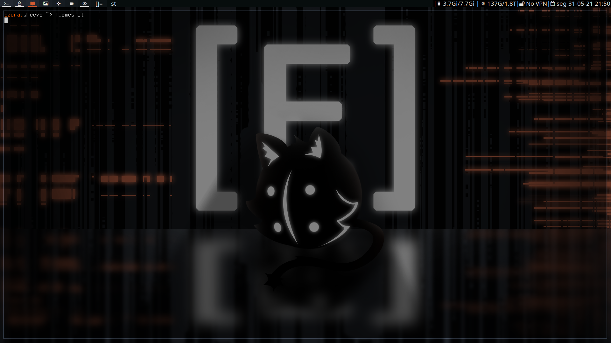

# My graphical interface

# DWM
My configs for dwm.
Some masks.
I use nerd font.

Mods added: 
- fullgaps
- rainbowtags (modified)
- underlinetags
- activetagindicatorbar
- barheight
- layoutmenu
- bar for each monitor

# Dmenu
Mods:
- border
- grids
- highlight

# Scripts
Automatically creates a degrade config.

